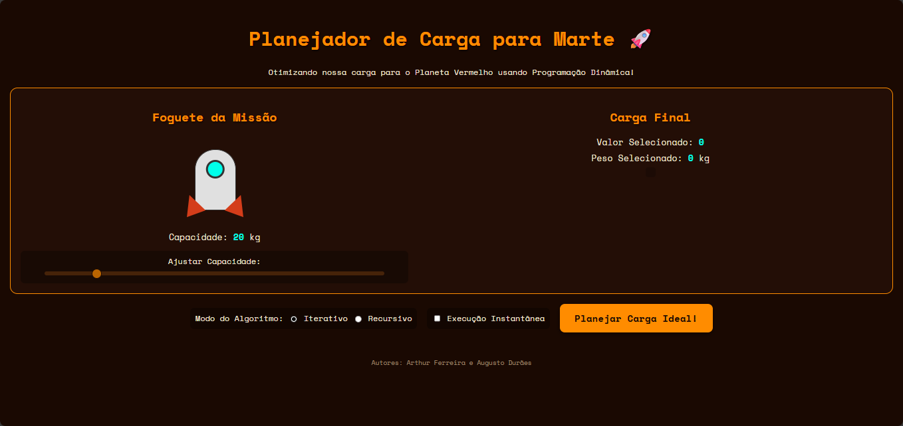
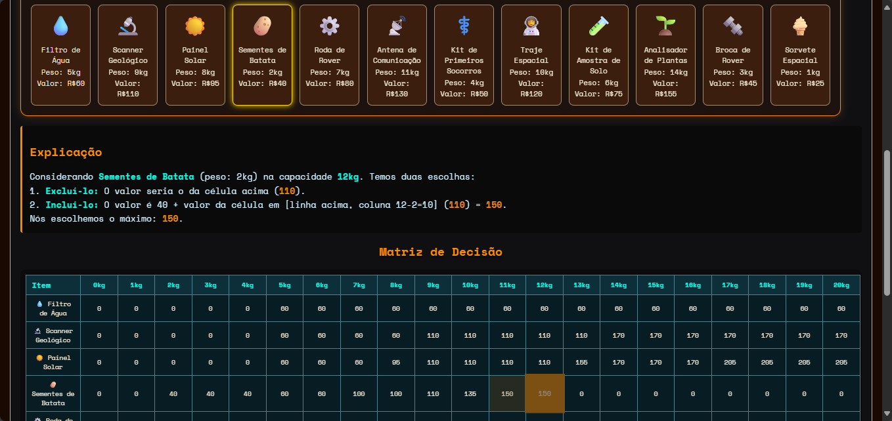
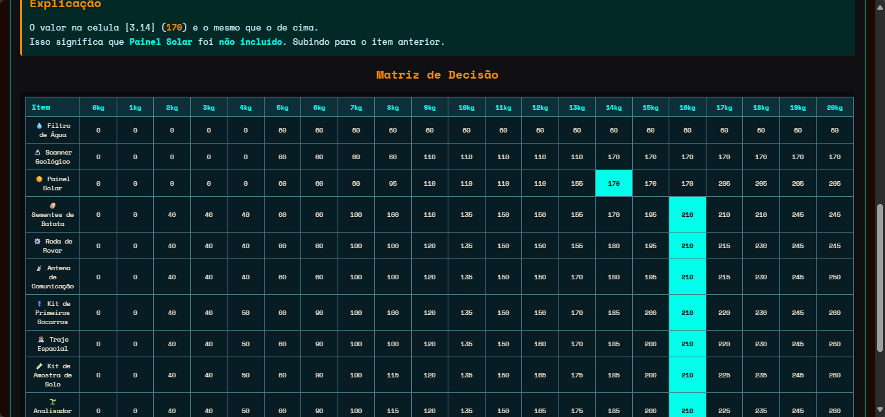
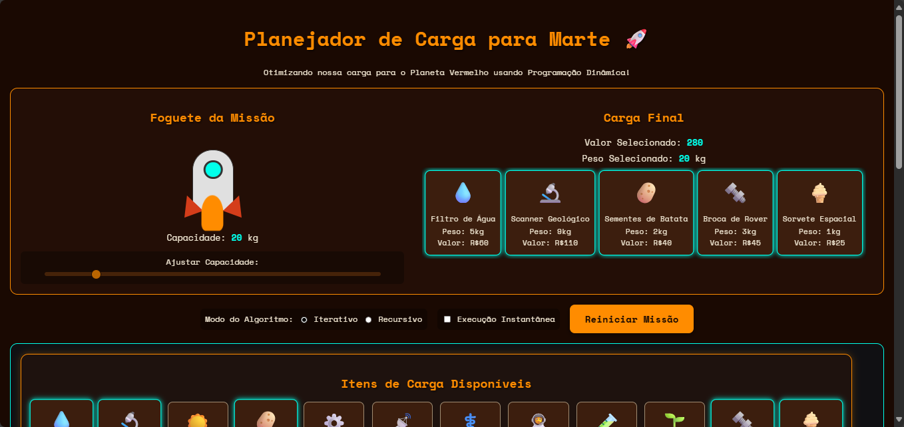
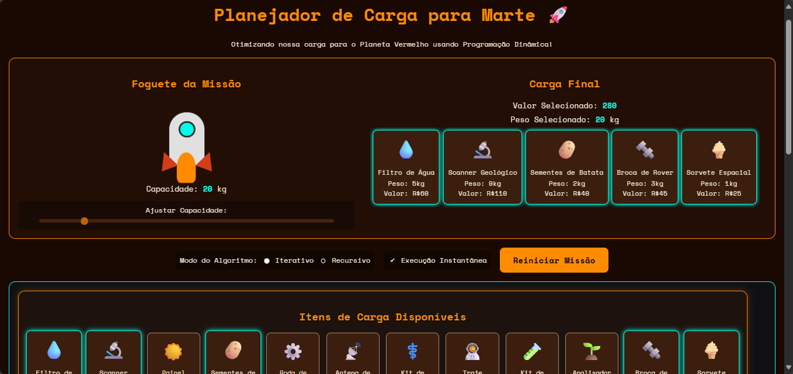
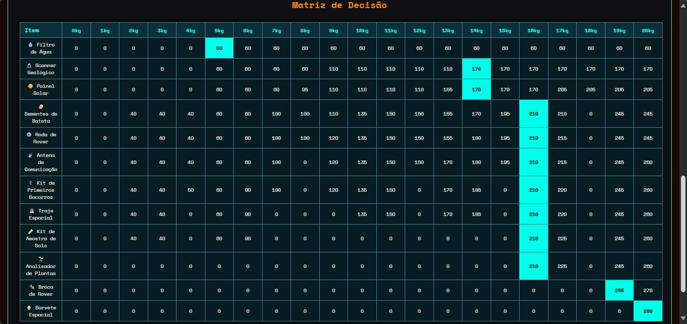

# **Programação Dinâmica - Rumo a Marte (knapsack)** 

**Conteúdo da Disciplina**: Programação Dinâmica

## Alunos

| Matrícula | Aluno                     |
| --------- | ------------------------- |
| 200056981 | Arthur Ferreira Rodrigues |
| 190084731 | Augusto Duraes Camargo    |

## Link para o Vídeo

[Vídeo no Youtube](https://youtu.be/sy21hikJhm)

## Sobre

O objetivo principal é educacional: demonstrar visualmente como os algoritmos de programação dinâmica funcionam para resolver o Problema da Mochila. A interface permite que os usuários comparem as duas principais estratégias de PD e entendam suas diferenças de execução.

### Estratégias de Algoritmo Implementadas

**1. Iterativa (Bottom-Up)**
- Constrói uma tabela de programação dinâmica (DP table) de baixo para cima.
- Preenche a tabela iterativamente, calculando a solução ótima para subproblemas de capacidade e itens crescentes.
- A visualização mostra cada célula da tabela sendo preenchida passo a passo, com explicações sobre as decisões de incluir ou não um item.

**2. Recursiva com Memoização (Top-Down)**
- Resolve o problema de forma recursiva, quebrando-o em subproblemas menores.
- Utiliza um cache (memo) para armazenar os resultados de subproblemas já resolvidos, evitando recálculos.
- A visualização destaca as chamadas de função na tabela DP, mostrando quando um valor é calculado pela primeira vez e quando um "acerto de cache" (memo hit) ocorre.

### Funcionalidades da Aplicação

- **Visualização Interativa**: Acompanhe o preenchimento da tabela DP para o método iterativo e as chamadas de função para o método recursivo.
- **Controle de Capacidade**: Ajuste a capacidade máxima de peso do foguete com um slider.
- **Seleção de Algoritmo**: Alterne facilmente entre os modos 'Iterativo' e 'Recursivo'.
- **Modo Instantâneo**: Pule as animações para ver o resultado final instantaneamente.
- **Explicações em Tempo Real**: Textos dinâmicos explicam cada passo do cálculo do algoritmo.
- **Destaque do Resultado**: Após a conclusão, a aplicação destaca os itens selecionados e mostra o caminho ótimo percorrido na tabela.

## Screenshots

`Repare na diferença das matrizes de decisão entre os algoritmos iterativo e recursivo`

### Execução "passo a passo" do algoritmo iterativo






### Execução "instantânea" do algoritmo recursivo




## Instalação

A aplicação consiste em um frontend (HTML, CSS, JS) e um backend (Python/Flask).

**Linguagem**: Python 3.9+
**Frameworks e Bibliotecas**:
- Flask (servidor web)
- Flask-Cors (para permitir requisições do frontend)

### Pré-requisitos

1. Python 3.9 ou superior.
2. Pip (gerenciador de pacotes Python).

### Passos para instalação

1. Instale as dependências do backend:
   ```bash
   pip install -r requirements.txt
   ```

2. Não há dependências para o frontend, basta um navegador web moderno.

## Uso

Para executar a aplicação, você precisa iniciar o servidor de backend e depois abrir o arquivo do frontend no seu navegador.

1. Execute o servidor Flask:
   ```bash
   python backend/app.py
   ```
   O servidor estará rodando em `http://127.0.0.1:5000`.

2. Abra o arquivo `frontend/index.html` em seu navegador web.

3. Navegação na aplicação:
   - **Ajuste a Capacidade**: Use o slider para definir o peso máximo que o foguete pode carregar.
   - **Escolha o Modo**: Selecione "Iterativo" ou "Recursivo".
   - **Inicie o Planejamento**: Clique em "Planejar Carga Ideal!" para iniciar a visualização.
   - **Reinicie**: Após a conclusão, o botão mudará para "Reiniciar Missão" para que você possa tentar novamente com diferentes parâmetros.

## Estrutura do Projeto

- **`backend/app.py`**: Contém a lógica do servidor Flask, os endpoints da API e a implementação dos algoritmos do Problema da Mochila.
- **`frontend/index.html`**: A estrutura principal da página web.
- **`frontend/style.css`**: Contém todos os estilos para a temática de Marte e a interface do usuário.
- **`frontend/script.js`**: Lida com a interação do usuário, as chamadas de API para o backend e a lógica de visualização passo a passo.
- **`requirements.txt`**: Lista as dependências Python para o backend.